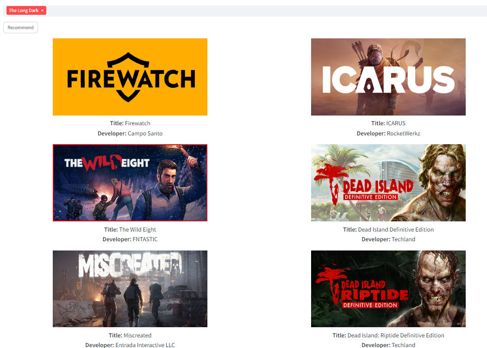

# Game Recomender System
## Steam Content-Based RS

## Introduction
As the gaming industry continues to experience rapid growth, driven by the vast array of games available worldwide, the sheer abundance of options presents a challenge for gamers in selecting which game to play. In response to this, global gaming companies would benefit from creating powerful game recommender systems tailored to users' interests amidst the overwhelming array of choices. 
The implementation of recommender systems by companies has proven to be highly relevant in driving increased sales and enhancing customer satisfaction. By offering personalized recommendations and tailored offers, companies can effectively attract and retain customers. For instance, sending targeted emails with links to new offers or suggestions for movies and TV shows based on individual preferences can significantly engage customers and foster loyalty.
____

## Implemented tasks
+ Analyze data from Steam, SteamSpy, and Metacritic services to form a dataset.
+ Develop a recommender system based on content-based filtering using the created dataset.
+ Deploy the finished recommender system on Streamlit app.
+ Evaluate the effectiveness of the obtained model.
____

## Content-based filtering (Recommender System itself)
A **recommender system**, as the name suggests, is a type of machine learning system that provides personalized recommendations to users based on their past behaviors, preferences, and patterns.

**Content-based filtering** customizes suggestions based on user interactions by analyzing characteristics and keywords connected to items in a database. It correlates them with a user’s profile formed from their activities such as purchases, ratings, searches, and clicks. By concentrating on individual preferences, content-based filtering delivers tailored recommendations that match each user’s unique tastes and interests.

**Advantages:**
+ This model operates independently, requiring no data from users.
+ Scalability is effortless, even with large user bases.
+ Highly relevant recommendations foster user trust and engagement, as user perceive the suggestions as personalized and pertinent.
+ By circumventing the “cold start” problem, content-based filtering mitigates the challenge faced by collaborative filtering in nascent communities or platforms with limited user data.

**Disadvantages:**
+ Recommendations are limited to the user’s established interests, lacking ability to introduce novel or diverse suggestions.
+ Scalability presents a hurdle, as every addition of a new product, service, or content necessitates meticulous attribute identification and tagging.
+ Inaccuracies and inconsistencies in attribute assignment may arise, potentially leading to flawed recommendations or user dissatisfaction.
____

## Approach
+ TF-IDF Vectorization
+ PorterStemmer
+ Cosine Similarity
+ Streamlit deployment
____

## Outcome Display
### Personal analysis 
The efficacy of the recommender system was thoroughly tested through a series of evaluations, one of which involved personal testing. Among the dropdown list of all available games, “The Long Dark”, a captivating first-person survival video game developed and published by Hinterland Studios, was chosen. In this immersive gaming experience, players embark on a journey as Will Mackenzie, a crash-landed bush pilot tasked with navigating the unforgiving Canadian wilderness in the aftermath of a geomagnetic storm.
The recommender system presented 6 the most appropriate games: “Firewatch”, “Icarus”, “The Wild Eight”, “Dead Island Definite Edition”, “Miscreated”, and “Dead Island Riptide Definition Edition”. Each of these games shares thematic elements or gameplay mechanics reminiscent of the rugged survival challenges found in "The Long Dark."
- Firewatch: Adventure, Narrative-driven, Walking simulator.
- ICARUS: Survival, Open-world, Multiplayer.
- The Wild Eight: Survival, Open-world, Adventure, Co-op.
- Dead Island Definitive Edition: Action, Survival horror, Open-world.
- Miscreated: Survival, Open-world, Multiplayer.
- Dead Island: RDE: Action, Survival horror, Open-world.

### Metrics analysis 
> MAE: 2.069273763487834

> RMSE: 2.586700024179224
